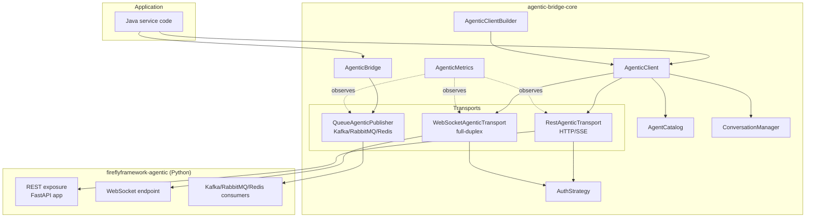

# Architecture

Copyright 2026 Firefly Software Foundation. Licensed under the Apache License 2.0.

This document describes the high-level architecture, design principles, and module
layout of `fireflyframework-agentic-bridge`. It is the canonical reference for
contributors and integrators.

---

## 1. Purpose

The bridge is the **first-class Java integration layer** for
[`fireflyframework-agentic`](https://github.com/fireflyframework/fireflyframework-agentic) —
the Python GenAI metaframework that hosts agents, tools, reasoning patterns, and
orchestration pipelines. Java applications running on the Firefly Framework
(Spring Boot 3.x, reactive WebFlux, Reactor) need a structured, professional
client to:

- Invoke remote agents over REST with strongly-typed requests and responses.
- Stream tokens back through Server-Sent Events (SSE) and WebSockets.
- Maintain multi-turn conversations with explicit conversation IDs.
- Publish agent invocations to Kafka, RabbitMQ, or Redis for asynchronous workloads.
- Discover available agents through the catalog endpoint.
- Authenticate with API keys or bearer tokens.
- Propagate W3C Trace Context for end-to-end distributed tracing.
- Expose Spring Boot Actuator health checks and Micrometer metrics.

The bridge is the canonical answer to the question "how do I call a Firefly
agent from a Java microservice?".

---

## 2. Design Principles

1. **Reactive by default** — All network operations return `Mono<T>` or
   `Flux<T>`. The bridge integrates seamlessly with WebFlux pipelines, CQRS
   handlers, and reactive sagas without thread-blocking calls.
2. **Builder-driven** — `AgenticClientBuilder` mirrors the fluent style of
   `RestClientBuilder` from `fireflyframework-client`, so Firefly developers
   already know the API.
3. **Transport-agnostic core** — `AgenticTransport` abstracts how an
   invocation reaches the agent. REST, WebSocket, and queue transports all
   implement the same contract; consumers write against the interface.
4. **Faithful protocol** — Request and response DTOs match exactly the
   `AgentRequest`, `AgentResponse`, multimodal parts, and SSE events emitted
   by `fireflyframework-agentic`. There is no translation layer.
5. **Spring Boot autoconfiguration** — A separate autoconfigure artifact
   wires `AgenticClient`, health indicators, metrics, and a discovered
   `AgentCatalog` from `application.yml` so that nothing more than adding
   the starter is required.
6. **Observable** — Every invocation produces a Micrometer timer plus
   counters; every queue dispatch is traced; every reactive chain carries a
   correlation ID; W3C Trace Context headers (`traceparent`, `tracestate`)
   are propagated bidirectionally.
7. **Resilient** — Timeouts, reactive retries with exponential backoff and
   jitter, and an optional Resilience4j circuit breaker are first-class
   builder options.
8. **Strict error model** — Every failure surfaces as a typed subclass of
   `AgenticBridgeException`, which extends `FireflyInfrastructureException`
   from `fireflyframework-kernel` so existing framework error handlers catch
   it.
9. **Zero stubs, zero TODOs** — Every public API in the published artifacts
   has a working implementation. There are no abstract holes left for
   downstream consumers to fill.

---

## 3. Module Layout

```
fireflyframework-agentic-bridge/                    aggregator (pom)
├── fireflyframework-agentic-bridge-core/           SDK + transport implementations (jar)
├── fireflyframework-agentic-bridge-autoconfigure/  Spring Boot 3 auto-configuration (jar)
├── fireflyframework-agentic-bridge-starter/        Starter convenience (pom)
└── fireflyframework-agentic-bridge-samples/        Runnable Spring Boot sample (jar)
```

Each module has its own POM that inherits from `fireflyframework-parent`, the
project-wide Maven parent shared with every other framework component.

### 3.1 Why the split?

| Module          | Why it exists                                                                                               |
|-----------------|-------------------------------------------------------------------------------------------------------------|
| `core`          | Usable from a plain Java application without Spring. Provides interfaces, builders, and transports.          |
| `autoconfigure` | Spring Boot users get bean wiring, configuration properties, health indicator, and metrics for free.        |
| `starter`       | Single dependency that pulls in `core + autoconfigure + WebFlux + Reactor + Resilience4j`.                  |
| `samples`       | Living documentation. A Boot application that exercises every transport.                                    |

This mirrors `fireflyframework-callbacks` and `fireflyframework-webhooks`,
which both use the multi-module pattern.

---

## 4. Core Component Diagram



---

## 5. Public API Surface

### 5.1 `AgenticClient`

The primary façade for synchronous-style (reactive) agent invocation.

```java
public interface AgenticClient {
    Mono<AgentResponse> invoke(String agentName, AgentRequest request);
    Flux<StreamEvent> stream(String agentName, AgentRequest request);
    Flux<StreamEvent> streamIncremental(String agentName, AgentRequest request);
    Mono<AgentCatalog> catalog();
    ConversationManager conversations();
    Mono<AgenticHealth> health();
    void close();
}
```

### 5.2 `AgenticBridge`

A higher-level façade that combines an `AgenticClient` with optional queue
publishers, providing a single entry point for either synchronous invocation
or fire-and-forget queue dispatch.

```java
public interface AgenticBridge {
    AgenticClient client();
    Optional<QueueAgenticPublisher> publisher(String name);
    Mono<AgenticHealth> health();
}
```

### 5.3 `AgenticClientBuilder`

```java
AgenticClient client = AgenticClient.builder("primary")
    .baseUrl("http://agentic.platform.local:8000")
    .auth(AuthStrategy.bearer("eyJhbGciOi..."))
    .timeout(Duration.ofSeconds(60))
    .retry(r -> r.maxAttempts(3).initialBackoff(Duration.ofMillis(250)))
    .circuitBreaker(cb -> cb.failureRateThreshold(50f))
    .userAgent("payments-svc/1.0.0")
    .meterRegistry(meterRegistry)
    .build();
```

### 5.4 Conversation API

```java
ConversationManager conversations = client.conversations();

Mono<Conversation> session = conversations.create();
Mono<AgentResponse> turn = session.flatMap(s ->
    client.invoke("assistant", AgentRequest.of("Summarise the last call.")
        .withConversationId(s.id())));
Mono<List<ConversationMessage>> history = conversations.history(conversationId);
Mono<Void> end = conversations.delete(conversationId);
```

### 5.5 Streaming

```java
Flux<StreamEvent> events = client.stream("writer",
    AgentRequest.of("Draft a release note for v2.0."));

events.subscribe(event -> {
    switch (event) {
        case TokenEvent token -> System.out.print(token.text());
        case ChunkEvent chunk -> appendChunk(chunk);
        case ResultEvent result -> finalise(result);
        case ErrorEvent error -> handleError(error);
        case DoneEvent done -> markComplete();
    }
});
```

### 5.6 Queue dispatch

```java
QueueAgenticPublisher kafkaPublisher = bridge.publisher("kafka").orElseThrow();
Mono<Void> sent = kafkaPublisher.publish(QueueInvocation.of("summariser",
    AgentRequest.of(longDocument))
    .withRoutingKey("summary.long"));
```

---

## 6. Transport Implementations

| Transport      | Protocol      | Module                | Backed by                                    |
|----------------|---------------|-----------------------|----------------------------------------------|
| REST + SSE     | HTTP/HTTP2    | core                  | Spring `WebClient` over Reactor Netty        |
| WebSocket      | WS / WSS      | core                  | Spring `ReactorNettyWebSocketClient`         |
| Kafka          | TCP           | core (optional dep)   | `reactor-kafka`                              |
| RabbitMQ       | AMQP 0-9-1    | core (optional dep)   | `reactor-rabbitmq`                           |
| Redis          | RESP          | core (optional dep)   | Lettuce reactive (`spring-boot-starter-data-redis-reactive`) |

The queue dependencies are declared `<optional>true</optional>` in the core
POM. Users who do not need a particular broker do not pay for its transitive
dependencies.

---

## 7. Configuration

Spring Boot users configure the bridge from `application.yml`:

```yaml
firefly:
  agentic-bridge:
    enabled: true
    primary:
      base-url: http://agentic.platform.local:8000
      timeout: 60s
      auth:
        type: bearer
        token: ${AGENTIC_TOKEN}
      retry:
        max-attempts: 3
        initial-backoff: 250ms
      circuit-breaker:
        enabled: true
        failure-rate-threshold: 50
    publishers:
      kafka:
        type: kafka
        topic: agent-invocations
        bootstrap-servers: kafka:9092
```

Properties are bound to the `AgenticBridgeProperties` class, which is
annotated with `@ConfigurationProperties(prefix = "firefly.agentic-bridge")`
and ships a `META-INF/spring-configuration-metadata.json` for IDE
auto-completion.

---

## 8. Observability

Every invocation emits the following Micrometer instruments:

| Instrument                                         | Type    | Tags                                         |
|----------------------------------------------------|---------|----------------------------------------------|
| `firefly.agentic.bridge.invocations`               | Counter | `client`, `agent`, `transport`, `outcome`    |
| `firefly.agentic.bridge.invocation.duration`       | Timer   | `client`, `agent`, `transport`, `outcome`    |
| `firefly.agentic.bridge.stream.tokens`             | Counter | `client`, `agent`, `mode`                    |
| `firefly.agentic.bridge.stream.duration`           | Timer   | `client`, `agent`, `mode`, `outcome`         |
| `firefly.agentic.bridge.publish`                   | Counter | `publisher`, `transport`, `outcome`          |
| `firefly.agentic.bridge.publish.duration`          | Timer   | `publisher`, `transport`, `outcome`          |

Distributed traces propagate via `traceparent` and `tracestate` headers on
every REST request, every WebSocket handshake, and as Kafka headers on every
queue message.

---

## 9. Security Model

### 9.1 Transport security

- **HTTPS/WSS** is the default; the bridge refuses to start with an `http://`
  base URL when `firefly.agentic-bridge.security.require-tls=true` (the
  production default profile).
- Custom truststores can be supplied via the standard `javax.net.ssl.*`
  properties or programmatically via `AgenticClientBuilder.sslContext(...)`.

### 9.2 Authentication

- `AuthStrategy.apiKey(String)` injects an `X-API-Key` header.
- `AuthStrategy.bearer(String)` injects an `Authorization: Bearer …` header.
- `AuthStrategy.bearer(Supplier<String>)` accepts a token provider so the
  bridge plays nicely with the existing `OAuth2ClientHelper` from
  `fireflyframework-client`.
- `AuthStrategy.composite(...)` chains multiple strategies; the first
  non-empty header wins.

### 9.3 Sensitive data

The bridge never logs request bodies or tokens at INFO. DEBUG log lines
redact tokens to the last four characters.

---

## 10. Error Hierarchy

```
FireflyException
└── FireflyInfrastructureException                 (kernel)
    └── AgenticBridgeException
        ├── AgentNotFoundException                 (HTTP 404)
        ├── AgentInvocationException               (server-side error returned by agent)
        ├── AgenticAuthenticationException         (HTTP 401/403)
        ├── AgenticRateLimitException              (HTTP 429)
        ├── AgenticTimeoutException                (response timeout, retries exhausted)
        ├── AgenticTransportException              (network or protocol failure)
        └── AgenticStreamException                 (SSE/WebSocket parse failure)
```

Each exception captures the agent name, transport, HTTP status (where
applicable), and originating request ID — surfaced through `getErrorContext()`
in the same shape as `ServiceClientException` from `fireflyframework-client`.

---

## 11. Testing Strategy

| Layer            | Tool                | Goal                                              |
|------------------|---------------------|---------------------------------------------------|
| Unit             | JUnit 5 + Mockito   | Builders, request/response models, decoders.      |
| Reactive         | `StepVerifier`      | All `Mono`/`Flux` chains.                         |
| REST integration | WireMock            | End-to-end against a stubbed agentic server.      |
| Auto-config      | `ApplicationContextRunner` | Conditional bean wiring in every profile.   |
| Sample           | Spring Boot test    | Sanity check of starter + autoconfigure.          |

Integration tests against the real Python service are out of scope for the
PR gate but are documented in `docs/INTEGRATION_TESTING.md` for nightly runs.

---

## 12. Versioning & Release

Calendar versioning aligned with the rest of the framework
(`YY.MM.PATCH`, currently `26.04.01`). The bridge is published to Maven
Central under `org.fireflyframework`. A GitHub Actions workflow signs and
publishes via the parent project's `maven-central` profile.
