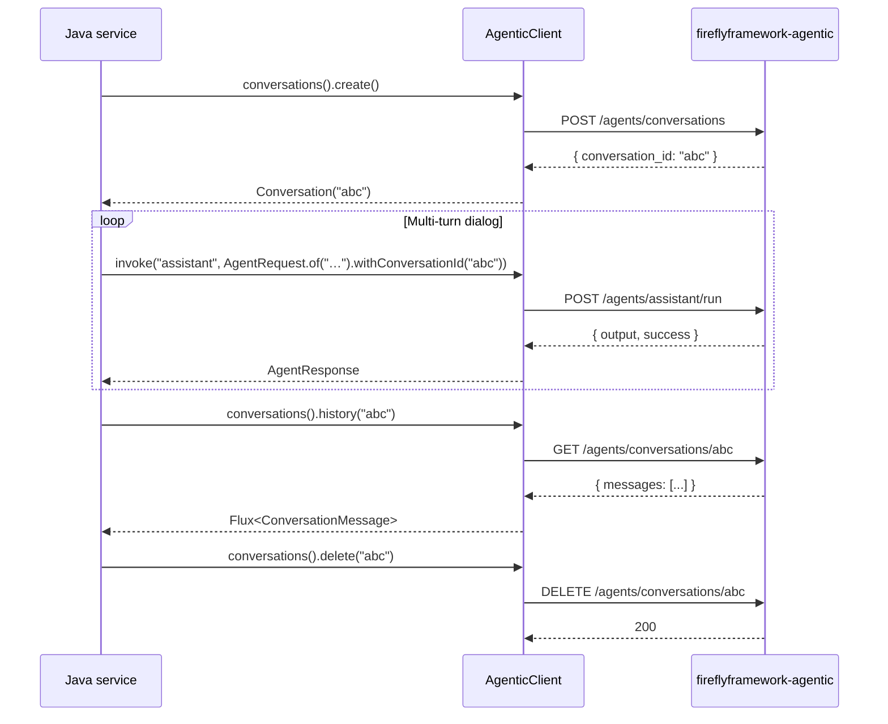

# Conversation API

Copyright 2026 Firefly Software Foundation. Licensed under the Apache License 2.0.

The bridge exposes a typed reactive client for the
`/agents/conversations` CRUD endpoints on the agentic side.
Conversation IDs link individual `AgentRequest` invocations together so
the model retains context across turns.

---

## Lifecycle



---

## API

```java
ConversationManager conversations = client.conversations();

Mono<Conversation> create();
Flux<ConversationMessage> history(String conversationId);
Mono<Void> delete(String conversationId);
```

`Conversation` carries the server-issued `id` plus the local
`createdAt` timestamp.

`ConversationMessage` exposes the raw payload as a `Map<String, Object>`
plus the conventional `role` and `content` accessors. Message shapes vary
by model and pydantic-ai version, so the raw view is the source of truth
for advanced inspection.

---

## Patterns

### Send-and-recall

```java
Mono<String> reply = client.conversations().create()
        .flatMap(session -> client.invoke("assistant",
                AgentRequest.of("What's our standing meeting agenda?")
                        .withConversationId(session.id()))
                .map(r -> r.outputAsString(mapper)));
```

### Resume an existing conversation

```java
Flux<StreamEvent> stream = client.streamIncremental("assistant",
        AgentRequest.of("Continue from where we left off.")
                .withConversationId(existingId));
```

### Bounded sessions

Wrap conversation creation and deletion in
`Flux.usingWhen(...)` to guarantee cleanup:

```java
Flux<StreamEvent> tokens = Flux.usingWhen(
        client.conversations().create(),
        session -> client.streamIncremental("assistant",
                AgentRequest.of(prompt).withConversationId(session.id())),
        session -> client.conversations().delete(session.id()));
```
